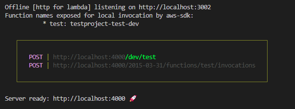

# Getting started with Serverless test project

## Available scripts

In the project directory, you can run

### `npm install`

### `npm start`

Runs the app in the development mode

### `npm run build`

Builds the app
